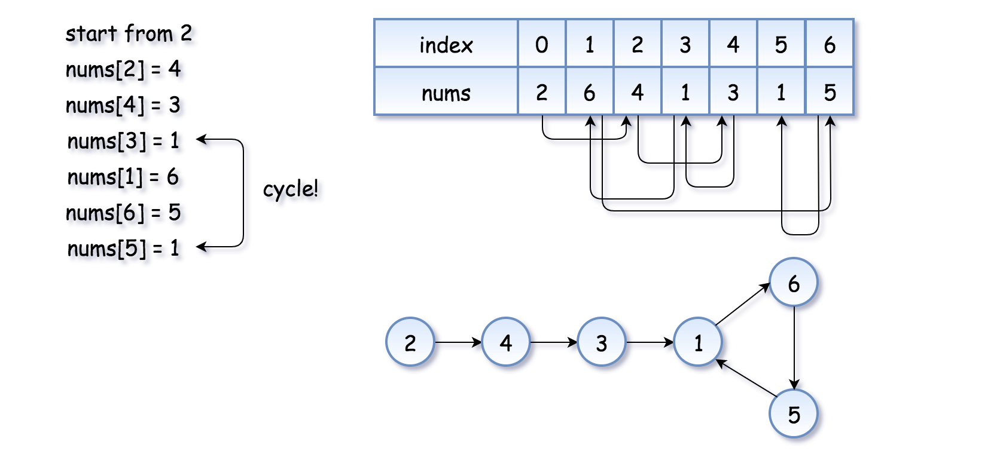
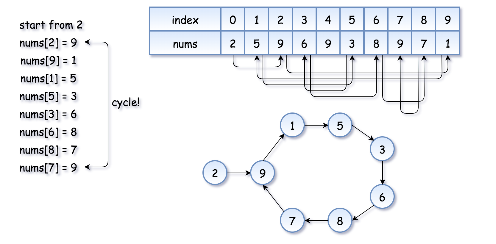

# Array

## 448. Find All Numbers Disappeared in an Array

```
Given an array of integers where 1 ≤ a[i] ≤ n (n = size of array), some elements appear twice and others appear once.

Find all the elements of [1, n] inclusive that do not appear in this array.

Could you do it without extra space and in O(n) runtime? You may assume the returned list does not count as extra space.

Example:

Input:
[4,3,2,7,8,2,3,1]

Output:
[5,6]
```

### Solution 1. Hash Table

* Use hash table

```python
class Solution:
    def findDisappearedNumbers(self, nums: List[int]) -> List[int]:
        dic = {}
        for num in nums:
            if num not in dic:
                dic.setdefault(num, 1)
        result = []
        
        for num in range(1, len(nums)+1):
            if num not in dic:
                result.append(num)
            
        return result
```

* Complexity:
  * Time: $O(N)$
  * Space: $O(N)$

### Solution 2. $O(1)$ Space Solution

* This method is set the element as the index, for example, 3 put into the third position.
* Since the elements only appear once or twice, so we set the index negative, and if the index is negative, skip the element.

```python
class Solution:
    def findDisappearedNumbers(self, nums: List[int]) -> List[int]:
        for i in range(len(nums)):
            index = abs(nums[i]) - 1
            if nums[index] > 0:
                nums[index] = nums[index] * (-1)
        result = []
        for i in range(1, len(nums)+1):
            if nums[i-1] > 0:
                result.append(i)
        return result
```

## 581. Shortest Unsorted Continuous Subarray

```
Given an integer array, you need to find one continuous subarray that if you only sort this subarray in ascending order, then the whole array will be sorted in ascending order, too.

You need to find the shortest such subarray and output its length.

Example 1:
Input: [2, 6, 4, 8, 10, 9, 15]
Output: 5
Explanation: You need to sort [6, 4, 8, 10, 9] in ascending order to make the whole array sorted in ascending order.
Note:
Then length of the input array is in range [1, 10,000].
The input array may contain duplicates, so ascending order here means <=.
```

### Solution 1. Sort

* Sort the list, find the left most and right most

```python
class Solution:
    def findUnsortedSubarray(self, nums: List[int]) -> int:
        #Sort
        sort_nums = sorted(nums)
        start = len(nums) - 1
        end = 0
        for i in range(len(nums)):
            if nums[i] != sort_nums[i]:
                start = min(start, i)
                end = max(end, i)
        
        return end - start + 1 if end - start > 0 else 0
```

### Solution 2. Stack 

## 15. 3Sum

```
Given an array nums of n integers, are there elements a, b, c in nums such that a + b + c = 0? Find all unique triplets in the array which gives the sum of zero.

Note:

The solution set must not contain duplicate triplets.

Example:

Given array nums = [-1, 0, 1, 2, -1, -4],

A solution set is:
[
  [-1, 0, 1],
  [-1, -1, 2]
]
```

### Solution 1.

```python
class Solution:
    def threeSum(self, nums: List[int]) -> List[List[int]]:
        if len(nums) < 3 or not nums:
            return []
        nums.sort()
        result = set()
        for i in range(len(nums)):
            if i >= 1 and nums[i]==nums[i-1]:
                continue
            d = {}
            for j in range(i+1, len(nums)):
                if nums[j] not in d:
                    d[-nums[i]-nums[j]] = 0
                else:
                    result.add((nums[i],-nums[j]-nums[i],nums[j]))
        return result
```

## 75. Sort Colors

```
Given an array with n objects colored red, white or blue, sort them in-place so that objects of the same color are adjacent, with the colors in the order red, white and blue.

Here, we will use the integers 0, 1, and 2 to represent the color red, white, and blue respectively.

Note: You are not suppose to use the library's sort function for this problem.

Example:

Input: [2,0,2,1,1,0]
Output: [0,0,1,1,2,2]
Follow up:

A rather straight forward solution is a two-pass algorithm using counting sort.
First, iterate the array counting number of 0's, 1's, and 2's, then overwrite array with total number of 0's, then 1's and followed by 2's.
Could you come up with a one-pass algorithm using only constant space?
```

### Solution 1. Three Points

* Rightmost of the first color
* Current index
* Leftmost of the third color
* Initialise the rightmost boundary of zeros : `p0 = 0`. During the algorithm execution `nums[idx < p0] = 0`.
* Initialise the leftmost boundary of twos : `p2 = n - 1`. During the algorithm execution `nums[idx > p2] = 2`.
* Initialise the index of current element to consider : `curr = 0`.
* While `curr <= p2` :
  - If `nums[curr] = 0` : swap `curr`th and `p0`th elements and move both pointers to the right.
  - If `nums[curr] = 2` : swap `curr`th and `p2`th elements. Move pointer `p2` to the left.
  - If `nums[curr] = 1` : move pointer `curr` to the right.

### 287. Find the Duplicate Number

```
Given an array nums containing n + 1 integers where each integer is between 1 and n (inclusive), prove that at least one duplicate number must exist. Assume that there is only one duplicate number, find the duplicate one.

Example 1:

Input: [1,3,4,2,2]
Output: 2
Example 2:

Input: [3,1,3,4,2]
Output: 3
Note:

You must not modify the array (assume the array is read only).
You must use only constant, O(1) extra space.
Your runtime complexity should be less than O(n2).
There is only one duplicate number in the array, but it could be repeated more than once.
```

### Solution 1. Sort

* $O(N)$, $O(N)$

### Solution 2. Set

* $O(N)$, $O(N)$

### Solution 3. Floyd's Tortoise and Hare(Cycle Detection)

* First of all, where does the cycle come from? Let's use the function `f(x) = nums[x]` to construct the sequence: `x, nums[x], nums[nums[x]], nums[nums[nums[x]]],`
* Each new element in the sequence is an element in nums at the index of the *previous* element.





```python
class Solution:
    def findDuplicate(self, nums: List[int]) -> int:
        fast, slow = nums[0], nums[0]
        while True:
            slow = nums[slow]
            fast = nums[nums[fast]]
            if slow == fast:
                break
        
        slow = nums[0]
        while fast != slow:
            fast = nums[fast]
            slow = nums[slow]
        return slow
```

