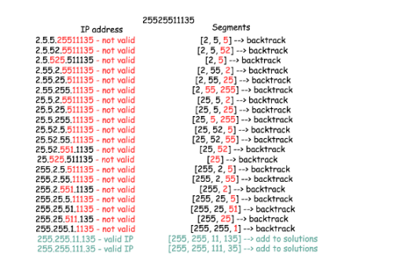
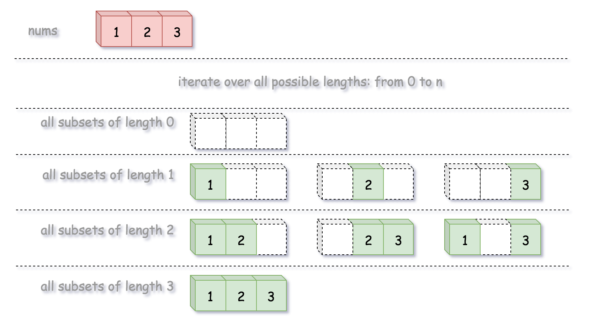

# Back Tracking

## 22. Generate Parentheses

```markdown
Given n pairs of parentheses, write a function to generate all combinations of well-formed parentheses.
For example, given n = 3, a solution set is:
[
  "((()))",
  "(()())",
  "(())()",
  "()(())",
  "()()()"
]
```

### Solution 1. Back Tracking

```python
class Solution:
    def generateParenthesis(self, n: int) -> List[str]:
        ans = []
        def backtrack(S = '', left = 0, right = 0):
            if len(S) == 2 * n:
                ans.append(S)
                return
            if left < n:
                backtrack(S+'(', left+1, right)
            if right < left:
                backtrack(S+')', left, right+1)

        backtrack()
        return ans
```

* Complexity(Pending)(reference: https://zhuanlan.zhihu.com/p/56693849)
  * Time: 
  * Space: 

### Solution 2. Closure Number(Pending)


## 17. Letter Combinations of a Phone Number

```markdown
Given a string containing digits from 2-9 inclusive, return all possible letter combinations that the number could represent.

A mapping of digit to letters (just like on the telephone buttons) is given below. Note that 1 does not map to any letters.

Example:

Input: "23"
Output: ["ad", "ae", "af", "bd", "be", "bf", "cd", "ce", "cf"].
```

### Solution 1. Back Tracking

* Store all the conditions for each number as hashmap.
* Back tracking each condition, if no next number, condition satisfy, end.
* Else, add each letter in this number, track next number list.

```python
class Solution:
    def letterCombinations(self, digits: str) -> List[str]:
        number = {
            '2' : ['a', 'b', 'c'],
            '3' : ['d', 'e', 'f'],
            '4' : ['g', 'h', 'i'],
            '5' : ['j', 'k', 'l'],
            '6' : ['m', 'n', 'o'],
            '7' : ['p', 'q', 'r', 's'],
            '8' : ['t', 'u', 'v'],
            '9' : ['w', 'x', 'y', 'z']
        }
        
        result = []
        def track(now, next_number):
            if not next_number:
                result.append(now)
            else:
                for letter in number[next_number[0]]:
                    track(now + letter, next_number[1:])
        if digits:
            track("", digits)
        return result
```

* Complexity

  * Time: 
    $$
    O(3^N * 4^M)
    $$
    N is the number of digits maps to 3 letters. M is the number of digits maps to 4 letters.

  * Space: 
    $$
    O(3^N * 4^M)
    $$
    N is the number of digits maps to 3 letters. M is the number of digits maps to 4 letters. Store all the solutions.


## 10. Regular Expression Matching(Pending) 

```
Given an input string (s) and a pattern (p), implement regular expression matching with support for '.' and '*'.

'.' Matches any single character.
'*' Matches zero or more of the preceding element.
The matching should cover the entire input string (not partial).

Note:

s could be empty and contains only lowercase letters a-z.
p could be empty and contains only lowercase letters a-z, and characters like . or *.
Example 1:

Input:
s = "aa"
p = "a"
Output: false
Explanation: "a" does not match the entire string "aa".
Example 2:

Input:
s = "aa"
p = "a*"
Output: true
Explanation: '*' means zero or more of the preceding element, 'a'. Therefore, by repeating 'a' once, it becomes "aa".
Example 3:

Input:
s = "ab"
p = ".*"
Output: true
Explanation: ".*" means "zero or more (*) of any character (.)".
Example 4:

Input:
s = "aab"
p = "c*a*b"
Output: true
Explanation: c can be repeated 0 times, a can be repeated 1 time. Therefore, it matches "aab".
Example 5:

Input:
s = "mississippi"
p = "mis*is*p*."
Output: false
```

### Solution 1. Regular Expression 


## 46. Permutations

```
Given a collection of distinct integers, return all possible permutations.

Example:

Input: [1,2,3]
Output:
[
  [1,2,3],
  [1,3,2],
  [2,1,3],
  [2,3,1],
  [3,1,2],
  [3,2,1]
]
```

### Solution 1. Back Tracking

* Go through all the position:
  * Swap cur with first
  * dfs(first + 1)
  * Swap cur with first(ensure next time get the right answer)

```python
class Solution:
    def permute(self, nums: List[int]) -> List[List[int]]:
        def dfs(first = 0):
            if first == len(nums):
                result.append(nums[:])
            for i in range(first, len(nums)):
                nums[first], nums[i] = nums[i], nums[first]
                dfs(first+1)
                nums[first], nums[i] = nums[i], nums[first]
                
        result = []
        dfs(first = 0)
        return result
```

* Complexity(Pending)

  * Time
    $$
    
    $$

  * Space
    $$
    
    $$

## 39. Combination Sum

```
Given a set of candidate numbers (candidates) (without duplicates) and a target number (target), find all unique combinations in candidates where the candidate numbers sums to target.

The same repeated number may be chosen from candidates unlimited number of times.

Note:

All numbers (including target) will be positive integers.
The solution set must not contain duplicate combinations.
Example 1:

Input: candidates = [2,3,6,7], target = 7,
A solution set is:
[
  [7],
  [2,2,3]
]
Example 2:

Input: candidates = [2,3,5], target = 8,
A solution set is:
[
  [2,2,2,2],
  [2,3,3],
  [3,5]
]
```

### Solution 1. Back Tracking

* For all the element in the candidates, check whether the remain is equal to the element.

```python
class Solution:
    def combinationSum(self, candidates: List[int], target: int) -> List[List[int]]:
        result = []
        candidates.sort()
        
        def dfs(remain, seq):
            if remain == 0:
                result.append(seq)
                return
            for item in candidates:
                if item > remain:
                    break
                if seq and item < seq[-1]:
                    continue
                else:
                    dfs(remain - item, seq + [item])
        dfs(target, [])
        return result
```

## 79. Word Search

```
Given a 2D board and a word, find if the word exists in the grid.

The word can be constructed from letters of sequentially adjacent cell, where "adjacent" cells are those horizontally or vertically neighboring. The same letter cell may not be used more than once.

Example:

board =
[
  ['A','B','C','E'],
  ['S','F','C','S'],
  ['A','D','E','E']
]

Given word = "ABCCED", return true.
Given word = "SEE", return true.
Given word = "ABCB", return false.
 

Constraints:

board and word consists only of lowercase and uppercase English letters.
1 <= board.length <= 200
1 <= board[i].length <= 200
1 <= word.length <= 10^3
```

### Solution 1. Back Tracking

* Find the first letter, search the adjacent cell. Then back tracking, and also put into original position.

```python
class Solution:
    def exist(self, board: List[List[str]], word: str) -> bool:
        def dfs(x, y, remain):
            if len(remain) == 0:
                return True
            if x < 0 or x >= len(board) or y < 0 or y >= len(board[0]) or board[x][y] != remain[0]:
                return False
            temp = board[x][y]
            board[x][y] = '~'
            for a, b in [(0,1), (0,-1), (1,0), (-1,0)]:
                ret = dfs(x+a,y+b,remain[1:])
                if ret:
                    return True
            board[x][y] = temp
            return False
        
        for i in range(len(board)):
            for j in range(len(board[0])):
                if dfs(i, j, word):
                    return True

        return False
```

## 93. Restore IP Addresses

```
Given a string containing only digits, restore it by returning all possible valid IP address combinations.

Example:

Input: "25525511135"
Output: ["255.255.11.135", "255.255.111.35"]
```

### Solution 1. Back Tracking

* Iterate over three available slots `curr_pos` to place a dot.
  - Check if the segment from the previous dot to the current one is valid :
    - Yes :
      - Place the dot.
      - Check if all 3 dots are placed :
        - Yes :
          - Add the solution into the output list.
        - No :
          - Proceed to place next dots `backtrack(curr_pos, dots - 1)`.
      - Remove the last dot to backtrack.

```python
class Solution:
    def restoreIpAddresses(self, s: str) -> List[str]:
        def valid(ip):
            return int(ip) <= 255 if ip[0] != '0' else len(ip) == 1
        
        def insert(cur):
            temp = s[cur+1:]
            if valid(temp):
                segments.append(temp)
                result.append('.'.join(segments))
                segments.pop()
        def dfs(prev = -1, dots = 3):
            for cur in range(prev + 1, min(len(s) - 1, prev + 4)):
                segment = s[prev + 1: cur + 1]
                if valid(segment):
                    segments.append(segment)
                    if dots == 1:
                        insert(cur)
                    else:
                        dfs(cur, dots - 1)
                    segments.pop()
                    

        result, segments = [], []
        dfs() 
        return result
```



## 1219. Path with Maximum Gold

### Solution 1. Back Tracking

* Just like 79. Word Search, go through all the possibility.

```python
class Solution:
    def getMaximumGold(self, grid: List[List[int]]) -> int:
        def dfs(row, col, cur):
            if 0 <= row < len(grid) and 0 <= col < len(grid[0]) and grid[row][col] > 0 :
                temp = grid[row][col]
                grid[row][col] = 0
                # to aviod repeat calculate
                dfs(row,col-1,cur + temp)
                dfs(row,col+1,cur + temp)
                dfs(row-1,col,cur + temp)
                dfs(row+1,col,cur + temp)
                self.max_temp = max(self.max_temp, cur + temp)
                grid[row][col] = temp
                
        self.max_temp = 0
        for i in range(len(grid)):
            for j in range(len(grid[0])):
                if grid[i][j] != 0:
                    dfs(i,j,0)
        return self.max_temp
```

## 60. Permutation Sequence

```
The set [1,2,3,...,n] contains a total of n! unique permutations.

By listing and labeling all of the permutations in order, we get the following sequence for n = 3:

"123"
"132"
"213"
"231"
"312"
"321"
Given n and k, return the kth permutation sequence.

Note:

Given n will be between 1 and 9 inclusive.
Given k will be between 1 and n! inclusive.
Example 1:

Input: n = 3, k = 3
Output: "213"
Example 2:

Input: n = 4, k = 9
Output: "2314"
```

### Solution 1. Math

* Position $k$ is $(k-1)/(n-1)!+1$, because if k is divide by $(n-1)!$, then the value will be zero. Make it fit into $(0,N!-1)$ interval
* Compute all factorial bases from $0$ to $(N-1)!$.

## 78. Subsets

```
Given a set of distinct integers, nums, return all possible subsets (the power set).

Note: The solution set must not contain duplicate subsets.

Example:

Input: nums = [1,2,3]
Output:
[
  [3],
  [1],
  [2],
  [1,2,3],
  [1,3],
  [2,3],
  [1,2],
  []
]
```

### Solution 1. Recursion

```python
class Solution:
    def subsets(self, nums: List[int]) -> List[List[int]]:
        ans = [[]]
        
        for num in nums:
            ans += [curr + [num] for curr in ans]
        return ans 
```

### Solution 2. Back Tracking




* We define a backtrack function named `backtrack(first, curr)` which takes the index of first element to add and a current combination as arguments.

- If the current combination is done, we add the combination to the final output.
- Otherwise, we iterate over the indexes `i` from `first` to the length of the entire sequence `n`.
  - Add integer `nums[i]` into the current combination `curr`.
  - Proceed to add more integers into the combination : `backtrack(i + 1, curr)`.
  - Backtrack by removing `nums[i]` from `curr`.

```python
class Solution:
    def subsets(self, nums: List[int]) -> List[List[int]]:
        def backtrack(first = 0, curr = []):
            if len(curr) == self.k:
                self.ans.append(curr[:])
            
            for j in range(first, len(nums)):
                curr.append(nums[j])
                backtrack(j+1, curr)
                curr.pop()
                
        self.ans = []
        for i in range(len(nums) + 1):
            self.k = i
            backtrack()
        return self.ans
```

