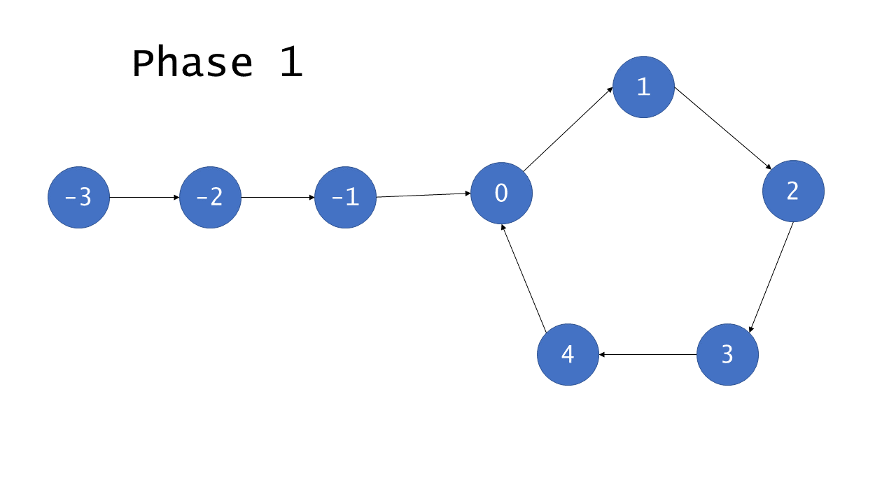

# Linked List

## 160. Intersection of Two Linked Lists

### [Instruction][https://leetcode.com/problems/intersection-of-two-linked-lists/]

### Solution 1. Two Pointers

* I think it's fast and slow pointer which could decided if there is a cycle.

```python
# Definition for singly-linked list.
# class ListNode:
#     def __init__(self, x):
#         self.val = x
#         self.next = None

class Solution:
    def getIntersectionNode(self, headA: ListNode, headB: ListNode) -> ListNode:
        if not headA or not headB:
            return
        A = headA
        B = headB
        
        while A != B:
            A = A.next if A else headB
            B = B.next if B else headA
        return A
            
```

## 234. Palindrome Linked List

```
Given a singly linked list, determine if it is a palindrome.

Example 1:

Input: 1->2
Output: false
Example 2:

Input: 1->2->2->1
Output: true
Follow up:
Could you do it in O(n) time and O(1) space?
```

### Solution 1. Two Pointers

* Use fast and slow pointer to find the second half.
* Reverse the second half of the list
* Start from the head and the second half, compare each value.

```python
# Definition for singly-linked list.
# class ListNode:
#     def __init__(self, x):
#         self.val = x
#         self.next = None

class Solution:
    def isPalindrome(self, head: ListNode) -> bool:
        if not head:
            return True
        first_end = head
        second_start = head
        
        #Find the second half
        fast = head
        slow = head
        while fast.next and fast.next.next:
            slow = slow.next
            fast = fast.next.next
        
        first_end = slow
        
        #Reverse
        prev = None
        curr = first_end.next
        while curr:
            temp = curr.next
            curr.next = prev
            prev = curr
            curr = temp
            
        second_start = prev
        
        #Compare
        first_start = head
        while second_start:
            if first_start.val != second_start.val:
                return False
            first_start = first_start.next
            second_start = second_start.next
        
        return True
        
```

## 876. Middle of the Linked List

```
Given a non-empty, singly linked list with head node head, return a middle node of linked list.

If there are two middle nodes, return the second middle node.

 

Example 1:

Input: [1,2,3,4,5]
Output: Node 3 from this list (Serialization: [3,4,5])
The returned node has value 3.  (The judge's serialization of this node is [3,4,5]).
Note that we returned a ListNode object ans, such that:
ans.val = 3, ans.next.val = 4, ans.next.next.val = 5, and ans.next.next.next = NULL.
Example 2:

Input: [1,2,3,4,5,6]
Output: Node 4 from this list (Serialization: [4,5,6])
Since the list has two middle nodes with values 3 and 4, we return the second one.
```

### Solution 1. Two Pointers

* Use fast and slow pointer
* Node that in the loop, we consider fast and fast.next since we want the last one if there're two middle nodes.

```python
# Definition for singly-linked list.
# class ListNode:
#     def __init__(self, x):
#         self.val = x
#         self.next = None

class Solution:
    def middleNode(self, head: ListNode) -> ListNode:
        fast = slow = head
        while fast and fast.next:
            slow = slow.next
            fast = fast.next.next
        return slow
```

## 142. Linked List Cycle II

```
Given a linked list, return the node where the cycle begins. If there is no cycle, return null.

To represent a cycle in the given linked list, we use an integer pos which represents the position (0-indexed) in the linked list where tail connects to. If pos is -1, then there is no cycle in the linked list.

Note: Do not modify the linked list.

 

Example 1:

Input: head = [3,2,0,-4], pos = 1
Output: tail connects to node index 1
Explanation: There is a cycle in the linked list, where tail connects to the second node.


Example 2:

Input: head = [1,2], pos = 0
Output: tail connects to node index 0
Explanation: There is a cycle in the linked list, where tail connects to the first node.


Example 3:

Input: head = [1], pos = -1
Output: no cycle
Explanation: There is no cycle in the linked list.


 

Follow-up:
Can you solve it without using extra space?
```

### Solution 1. HashSet

```
# Definition for singly-linked list.
# class ListNode:
#     def __init__(self, x):
#         self.val = x
#         self.next = None

class Solution:
    def detectCycle(self, head: ListNode) -> ListNode:
        #hash set
        visited = set()
        node = head
        while node:
            if node in visited:
                return node
            else:
                visited.add(node)
                node = node.next
        return None
```

### Solution 2. Two Pointer

* Floyd's algorithm Tortoise and Hare

* Phase 1

  * 
  * fast: hare, slow: tortoise
  * The cycle is labelled from $0$ to $C-1$, then $C$ is the length of the cycle.
  * The noncyclic is labelled from $-F$ to $-1$, then F is the length of the noncyclic.
  * After $F$ iterations, tortoise points to node 0 and hare points to some node $h$. $f\equiv h \ mod \ C$. Hare traverses $2F$, and exactly $F$ are in cycle.
  * After $C-h$, tortoise points to node $C-h$, hare points to the same node, because it traverse $2(C-h)$ from $h$,
  * $h+2(C-h) = 2C-h \equiv  C-h(mod\ C)$

* Phase 2

  * 

  * $$
    2*distance(tortoise) = distance(hare)\\
    2(F+a)=F+a+b+a\\
    2F+2a=F+2a+b\\
    F=b
    $$

  * Then pointer start at node $h$ and $0$ will traverse the same number of nodes before meeting

```python
# Definition for singly-linked list.
# class ListNode:
#     def __init__(self, x):
#         self.val = x
#         self.next = None

class Solution:
    def get(self, head):
        tortoise = head
        hare = head
        while hare and hare.next:
            tortoise = tortoise.next
            hare = hare.next.next
            if tortoise == hare:
                return hare
        return None
    
    def detectCycle(self, head: ListNode) -> ListNode:
        if not head:
            return
        start = self.get(head)
        if not start:
            return
        
        start_1 = head
        start_2 = start
        while start_1 != start_2:
            start_1 = start_1.next
            start_2 = start_2.next
        return start_1
        
```

