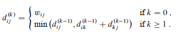

# LeetCode

## Divide And Conquer

* Divide: Break the problem into smaller sub-problems. Takes a recursive approach to divide until no sub-problem is further divisible.
* Conquer: The sub-problems are considered solved on their own.
* Merge: Recursively combines the sub-problems until they formulate a solution of the original problem.

## Dynamic Programming(Pending)

* Similar to divide and conquer. But these sub-problems are not solved independently, these sub-problems are remembered and used for similar or overlapping sub-problems.
* Before solving the in-hand sub-problem, the algorithm will try to examine the results of the previously solved sub-problems. Combine the solutions to achieve the best solution.
* General Solution
  * Characterize the structure of an optimal solution.
  * Recursively define the value of an optimal solution.
  * Compute the value of an optimal solution, typically in a bottom-up fashion.
  * Construct an optimal solution from computed information.
* Optimal Substructure

### Manacher's Algorithm

* Used for the palindromic problems. I think it's kind of DP solution.

#### Traditional DP Solution

* Set a $N*N$ matrix, store each substring condition.
* $dp[i,i] = True$
* $dp[j,i] = (s[i]==s[j])\ if\ i-j >=2$
* $dp[j,i] = (s[i]==s[j]\ and \ dp[j+1][i-1])$

#### Expand Around Center

* Choose a center, compare the left and right. If same, then $left--, \ right++$. And the number of palindromic substring ++.
* Time $O(N^2)$, Space $O(1)$

```python
for center in range(len(s)):
    self.helper(s, center, center)
    self.helper(s, center-1, center)

helper(s, left, right):
    while left >= 0 and right < len(s) and s[left] == s[right]:
        left -= 1
        right += 1
```

#### Manacher Algorithm

[Refer][https://www.cxyxiaowu.com/2665.html]

* To solve the problem of odd and even, insert $\#$ between each char. And "^" in the begin, "$" in the end.

* Define $P[i]$ as the radius of the largest length of substring centered at index $i$. 

* Suppose $R$ is the rightmost boundary of the longest substring centered at $i$, so we could say that $P[i] = R-i(1 \le i \le 2N-1)$ 

* Suppose $C$ is the center of the substring, $i$ is the position of an element whose span of palindromic is being determined, and $i$ is always at the right of C. $i'$ is the mirror position of $i$ with the center of $C$. 

*  Here is an example for the $P$ list.

  ```python
  i = 0 1 2 3 4 5 6 7 8
  T = # a # b # b # a #
  P = 0 1 0 1 4 1 0 1 0
  ```

* So we can see the longest of the palindromic substring is $4$ which is actually the length of $abba$. But how to determine the index

  * Actually the start of the substring is $(i-P[i])/2$ 
  * For $4, \ i=4, \ 4-4 = 0$, so start at $0$ 

* There're some condition.

  * If $p[i']\ is \ small\ than\ R-i$, it means there are mirror, so $p[i]=p[i']$ 
  * If $p[i']\ is \ equal\ than\ R-i$, it means that $i'$ could meet the left most boundary in the string, but $i$ may expand to the right, so $p[i]=p[i']$ then continue expand around center.
  * If $p[i']\ is \ bigger\ than\ R-i$, that means $p[i]$ couldn't be bigger than $R-i$ , so $p[i]=R-i$. Here is the prove
    * Consider there is a position called $a$ in the right of $R$, that is same as the position called $b$ between $C$ and $i$. 
    * As the $C$ is palindromic, so there must be a position called $d$ between $i'$ and $C$, that $d==b$ 
    * And $p[i'] > R-i$ , so there must have some element beyond the left most boundary of the radius of $C$. So we could expand the radius for $C$ which means $R$ will be larger.

* Conclusion:

  * $P[i] = min(R-i,P[i'])$
  * Attempt to expand from $i+P[i]+1$ and $i-P[i]-1$
  * $if \ i+P[i] > R: \ C,\ R = i, i+P[i]$

## Greedy(Pending)

* Find a localized optimum solution, may lead to globally optimized solutions.

* Because the problem is an optimization, greedy algorithm use a priority queue.

## Back Tracking

### Three types of problems

#### Decision Problem

* Search for a feasible solution

```python
def solve(node, path):
    path += [node]
    if node:
        return path if path else None
    
    for element in node:
        ans = solve(element, path)
        if ans is not None:
            return ans
    return None
```

#### Optimization Problem

* Search for the best solution

```python
best = -float("inf")
def find_best(node, path):
    path += [node]
    if node:
        if path satisfy:
            best = max(best, node)
        return
    
    for element in node:
        find_best(element, path)
```

#### Enumeration Problem

* Find all feasible solutions

```python
ans = []

def find_all(node, path):
    path += node
    if node:
        if path satisfy:
            ans += path
        return
    
    for element in node:
        find_all(element, path)

```

Reference: [BackTracking](http://summerisgreen.com/blog/2017-07-07-2017-07-07-算法技巧-backtracking.html)

## Data Structure


### Binary Trees

* A tree data structure in which each node has at most two children which are referred as left child and right child.
* There are many types of binary tree like balanced binary tree, perfect binary tree...
* 

### Binary Search Trees

* A binary search tree is organized in a binary tree.

* Binary Search Tree property: Node in the left subtree is no bigger than the parent node. Nodes in the right subtree is no smaller than the parent node.

* Recursive Algorithms $O(N)$:

  * Preorder: Parent, Left, Right
  * Inorder: Left, Parent, Right
  * Postorder: Left, Right, Parent

* Operations:

  * Search $O(H)$ h is the height of the tree: Begin search at root and traces downward.

  * Minimum and Maximum $O(H)$:

    * Minimum: Begin root, follow left child until meet NULL.
    * Maximum: Begin root, follow right child until meet NULL.

  * Successor and Predecessor $O(H)$:

    * Successor: The node ahead of given node

      * If right subtree is nonempty, the successor is the leftmost of the right subtree

      * Else, the successor is the lowest ancestor of x whose left child is also an ancestor of x.

      * 

      * For node 13, it doesn't have right sub tree. So to find it successor, follow the path up, until the node have left child which is 15(6 also has left child but it's not in the path followed by 13)

      * ```python
        if x.right != NIL:
            return TREE-MINIMUM(x.right)
        y = x.parent
        while y != NIL and x == y.right:
            x = y
            y = y.parent
        return y
        ```

    * Predecessor: The node behind of given node(Same as successor)

  * Insert $O(H)$

    * Set trailing pointer y as the parent of x.

  * Delete $O(H)$

    * If no children, then simply remove it and modify its parent.
    * If just one children, then we set that child to the original position, modify its parent.
    * If has two children, f2
    * ind the successor(predecessor is also acceptable) to replace this node.

### Balanced Binary Search Trees

* Balance: each operation makes local adjustments. There're many types of Balanced BST. Such as AVL, Red-Black, 

#### AVL

* For each node, the depths of its subtrees differ by at most 1.

## Search Algorithms

### Overview


### Binary Search

* A fast search algorithm with run-time of $O(logn)$. Works on the principle of divide and conquer. And the data collection should be sorted.
* $mid = low + (high-low)/2$, determine half of the array.

## Graph

### Transitive Closure Algorithm(Floyd-Warshall Algorithm)

* Based on Dynamic Programming, To find the shortest path between tow nodes.
* All-Pairs Shortest Paths, In a Weighted Graph with positive or negative edge weights(but with no negative cycles)
* In each iteration $k,\ T[u,v] = 1$ iff there is a path from $u$ to $v$ using intermediate vertices in $\{1, 2, ... , k\}$ 
* 
* 
* Run time is $O(n^3)$

## Advanced Data Structures

## Other Algorithm

### Floyd's algorithm Tortoise and Hare

* Phase 1

  * 
  * fast: hare, slow: tortoise
  * The cycle is labelled from $0$ to $C-1$, then $C$ is the length of the cycle.
  * The noncyclic is labelled from $-F$ to $-1$, then F is the length of the noncyclic.
  * After $F$ iterations, tortoise points to node 0 and hare points to some node $h$. $f\equiv h \ mod \ C$. Hare traverses $2F$, and exactly $F$ are in cycle.
  * After $C-h$, tortoise points to node $C-h$, hare points to the same node, because it traverse $2(C-h)$ from $h$,
  * $h+2(C-h) = 2C-h \equiv  C-h(mod\ C)$

* Phase 2

  * 

  * $$
    2*distance(tortoise) = distance(hare)\\2(F+a)=F+a+b+a\\2F+2a=F+2a+b\\F=b
    $$

  * Then pointer start at node $h$ and $0$ will traverse the same number of nodes before meeting

### Catalan Number(Pending)


### Dutch national flag problem

* The flag consists of three colors: red, white and blue. Given balls of these three colors arranged randomly in line. The task is to arrange them such that all balls of the same color are together.
* The solution is of interest for designing sorting algorithms.
* Use three point to store the rightmost of the first color, current index, leftmost of the third color.

## Bit Manipulation

* AND `&`  Return `1` if both is `1` otherwise `0`
* OR `|`  Return `1` if either of the bit is `1` else `0`
* NOT `~`. return one's complement of the number. `-x-1`  `a=10=1010`, `~a = ~1010 = -(1010+1)=-(1011)=-11`
* XOR `^` Return `1` if one of the bit is `1` and other is `0` else false
  * XOR of `zero and a bit` results in that bit
  * XOR of `one and a bit ` flips that bit
* Right Shift `>>` fill `0` on the left
* Left Shift  `<<` fill `0` on the right