# LeetCode

## Divide And Conquer

* Divide: Break the problem into smaller sub-problems. Takes a recursive approach to divide until no sub-problem is further divisible.
* Conquer: The sub-problems are considered solved on their own.
* Merge: Recursively combines the sub-problems until they formulate a solution of the original problem.

## Dynamic Programming(Pending)

* Similar to divide and conquer. But these sub-problems are not solved independently, these sub-problems are remembered and used for similar or overlapping sub-problems.
* Before solving the in-hand sub-problem, the algorithm will try to examine the results of the previously solved sub-problems. Combine the solutions to achieve the best solution.
* General Solution
  * Characterize the structure of an optimal solution.
  * Recursively define the value of an optimal solution.
  * Compute the value of an optimal solution, typically in a bottom-up fashion.
  * Construct an optimal solution from computed information.
* Optimal Substructure

### Manacher's Algorithm

* Used for the palindromic problems. I think it's kind of DP solution.

#### Traditional DP Solution

* Set a $N*N$ matrix, store each substring condition.
* $dp[i,i] = True$
* $dp[j,i] = (s[i]==s[j])\ if\ i-j >=2$
* $dp[j,i] = (s[i]==s[j]\ and \ dp[j+1][i-1])$

#### Expand Around Center

* Choose a center, compare the left and right. If same, then $left--, \ right++$. And the number of palindromic substring ++.
* Time $O(N^2)$, Space $O(1)$

```python
for center in range(len(s)):
    self.helper(s, center, center)
    self.helper(s, center-1, center)

helper(s, left, right):
    while left >= 0 and right < len(s) and s[left] == s[right]:
        left -= 1
        right += 1
```

#### Manacher Algorithm

[Refer][https://www.cxyxiaowu.com/2665.html]

* To solve the problem of odd and even, insert $\#$ between each char. And "^" in the begin, "$" in the end.

* Define $P[i]$ as the radius of the largest length of substring centered at index $i$. 

* Suppose $R$ is the rightmost boundary of the longest substring centered at $i$, so we could say that $P[i] = R-i(1 \le i \le 2N-1)$ 

* Suppose $C$ is the center of the substring, $i$ is the position of an element whose span of palindromic is being determined, and $i$ is always at the right of C. $i'$ is the mirror position of $i$ with the center of $C$. 

*  Here is an example for the $P$ list.

  ```python
  i = 0 1 2 3 4 5 6 7 8
  T = # a # b # b # a #
  P = 0 1 0 1 4 1 0 1 0
  ```

* So we can see the longest of the palindromic substring is $4$ which is actually the length of $abba$. But how to determine the index

  * Actually the start of the substring is $(i-P[i])/2$ 
  * For $4, \ i=4, \ 4-4 = 0$, so start at $0$ 

* There're some condition.

  * If $p[i']\ is \ small\ than\ R-i$, it means there are mirror, so $p[i]=p[i']$ 
  * If $p[i']\ is \ equal\ than\ R-i$, it means that $i'$ could meet the left most boundary in the string, but $i$ may expand to the right, so $p[i]=p[i']$ then continue expand around center.
  * If $p[i']\ is \ bigger\ than\ R-i$, that means $p[i]$ couldn't be bigger than $R-i$ , so $p[i]=R-i$. Here is the prove
    * Consider there is a position called $a$ in the right of $R$, that is same as the position called $b$ between $C$ and $i$. 
    * As the $C$ is palindromic, so there must be a position called $d$ between $i'$ and $C$, that $d==b$ 
    * And $p[i'] > R-i$ , so there must have some element beyond the left most boundary of the radius of $C$. So we could expand the radius for $C$ which means $R$ will be larger.

* Conclusion:

  * $P[i] = min(R-i,P[i'])$
  * Attempt to expand from $i+P[i]+1$ and $i-P[i]-1$
  * $if \ i+P[i] > R: \ C,\ R = i, i+P[i]$

## Greedy(Pending)

* Find a localized optimum solution, may lead to globally optimized solutions.

* Because the problem is an optimization, greedy algorithm use a priority queue.

## Back Tracking

### Three types of problems

#### Decision Problem

* Search for a feasible solution

```python
def solve(node, path):
    path += [node]
    if node:
        return path if path else None
    
    for element in node:
        ans = solve(element, path)
        if ans is not None:
            return ans
    return None
```

#### Optimization Problem

* Search for the best solution

```python
best = -float("inf")
def find_best(node, path):
    path += [node]
    if node:
        if path satisfy:
            best = max(best, node)
        return
    
    for element in node:
        find_best(element, path)
```

#### Enumeration Problem

* Find all feasible solutions

```python
ans = []

def find_all(node, path):
    path += node
    if node:
        if path satisfy:
            ans += path
        return
    
    for element in node:
        find_all(element, path)

```

Reference: [BackTracking](http://summerisgreen.com/blog/2017-07-07-2017-07-07-算法技巧-backtracking.html)

## Sort Algorithm

### Overview

* More detail conclusion: [sort][https://www.cnblogs.com/onepixel/p/7674659.html]

* In-place && Not-in-place: whether require any extra space or not.
* Stable && Not Stable: whether change the sequence of similar content in which they appear.
* Comparison or not:
  * Comparison: ...
  * Other: radix, bucket

### Selection Sort 

* For the entire list, find the smallest element, put in the first position.

### Insertion Sort 

* A sub-list is maintained sorted.
* Search sequentially and unsorted items are moved and inserted into the sub-list.
* To be short, just find element one by one, put into the right position.

### Bubble Sort 

* Compared each pair of adjacent elements, swap them if they are not in order.

### Shell Sort 

* Based on Insertion Sort, avoid large shift.

* Depend different gap value, combine the elements into a sorted list. Change gap.

* Based on Knuth's Formula, h is interval with initial value 1.
  $$
  \frac{3^k-1}{2}\  No\ greater\ than [N/3]
  $$

$$
O(N^{\frac{3}{2}})
$$

* Based on the original Shell, 
  $$
  \frac{N}{2^k}
  $$

  $$
  O(N^2)
  $$

### Quick Sort 

* Split array into two arrays. One has the elements smaller than the pivot. The other has the elements greater than the pivot.
* Has two points, the lower point, the higher point.
* While left smaller than pivot, move right. While right greater than pivot, move left.
* Else swap the two elements.
* When left meet right, put the pivot in this position.

### Merge Sort 

* Based on Divide and Conquer Technique.
* Divide into two groups until undivided.
* Sort each group, merge them one by one.

### Heap Sort 

* Based on Binary Heap data structure, which the parent is greater or smaller than children nodes.
* Build Max Heap. Then the root should contain max element. Swap with the last element.
* Heapify the max heap excluding the last element. Repeat this step.

### Radix Sort 

* If the elements are in range from 1 to $n^2$, use Radix Sort.
* Do digit by digit sort starting from least significant digit to most significant digit.

### Bucket Sort 

* Set up an array of empty buckets.
* Scatter: put each element in bucket.
* Sort and merge.

### Complexity

* Overview

  | Method    | Average    | Worst     | Best    | Space  | Stable |
  | --------- | ---------- | --------- | ------- | ------ | ------ |
  | Selection | $n^2$      | $n^2$     | $n^2$   | 1      | No     |
  | Insertion | $n^2$      | $n^2$     | $n$     | 1      | Yes    |
  | Bubble    | $n^2$      | $n^2$     | $n$     | 1      | Yes    |
  | Shell     | $n^{1.25}$ | $n^{1.5}$ | $nlogn$ | 1      | No     |
  | Quick     | $nlogn$    | $n^2$     | $nlogn$ | $logn$ | No     |
  | Merge     | $nlogn$    | $nlogn$   | $nlogn$ | $n$    | Yes    |
  | Heap      | $nlogn$    | $nlogn$   | $nlogn$ | 1      | No     |
  | Radix     | $n*k$      | $n*k$     | $n*k$   | $n+k$  | Yes    |
  | Bucket    | $n+k$      | $n^{2}$   | $n+k$   | $n+k$  | Yes    |

### Lower Bound for Comparison Sorting Algorithms

* Any comparison sort  must take $O(nlogn)$ comparisons in the worst case to sort $n$ elements.

* Proof (Assume all the input elements are distinct

  * 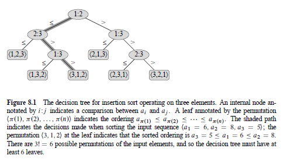

  * Represent the computation of a comparison sorting algorithm by its decision tree $T$.

  * Nodes: Comparisons

  * Leaves: Permutations

  * So number of leaves $l$ in $T\ge n!$ , Because each of the $n!$ permutations of the input will appear as some leaf.

  * And since the height $h$ has no more than $2^h$ leaves, so we get $n! \le l \le 2^h$. 

  * Then $h \ge log(n!)$ and $ log(n!) = O(nlogn)$

    * Stirling formula

    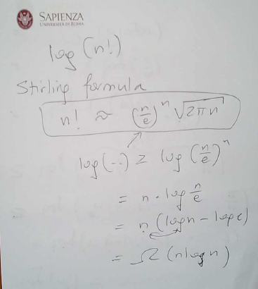

    * The other way

      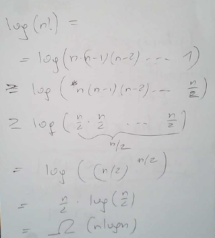


## Data Structure

### Overview


### Stack (LIFO)

* A last-in, first-out policy which means the element deleted from the set is the one most recently inserted. 
  * S.top: indexes the most recently inserted element.
* Bottom: S[1]
* Top: S[S.top]. When S.top == 0, the stack is empty. It could be test by STACK-EMPTY. **Overflows** means top exceeds. **Underflows** means empty stack, cause error when pop.
* Operations, all these three operations are O(1) :
  * STACK-EMPTY(S)
  * PUSH(S, x)
  * POP(S)

### Queue (FIFO)

* A first-in, first-out policy which means the element deleted from the set is the one that has been in the set for the longest time. 
  * Head: The head of the line
  * Tail: The end of the line
* When head == tail, empty queue. If attempt to dequeue the queue, cause underflows. When head == tail + 1 or (head == 1 and tail == length), full queue. If attempt to enqueue, cause overflows.
* Operations:
  * ENQUEUE: Insert operation. 
  * DEQUEUE: Delete operation. 

### Linked List

* The objects are arranged in a linear order, provide a simple, flexible representation for dynamic sets.
* Linked List have several forms, it may be either singly or doubly, it may be sorted or not, and it may be circular or not.

#### Singly Linked List

* No prev compared to the doubly linked list.

#### Doubly Linked List

* Each element is an object with key, next and prev.
  * x.next points to its successor
  * x.prev points to its predecessor
* Head means the first element, tail means the last element.

#### Operations

* Search: Find the first element with key k. $O(N)$
* Insert: Given an element with specific key, insert into the from of the linked list. $O(1)$
* Delete: Delete specific key. Worst: $O(N)$
  * Could be simpler if ignore the boundary conditions at the head and tail of the list.(Sentinel)
  * x.prev.next = x.next
  * x.next.prev = x.prev

### Binary Trees

* A tree data structure in which each node has at most two children which are referred as left child and right child.
* There are many types of binary tree like balanced binary tree, perfect binary tree...
* 

### Binary Search Trees

* A binary search tree is organized in a binary tree.

* Binary Search Tree property: Node in the left subtree is no bigger than the parent node. Nodes in the right subtree is no smaller than the parent node.

* Recursive Algorithms $O(N)$:

  * Preorder: Parent, Left, Right
  * Inorder: Left, Parent, Right
  * Postorder: Left, Right, Parent

* Operations:

  * Search $O(H)$ h is the height of the tree: Begin search at root and traces downward.

  * Minimum and Maximum $O(H)$:

    * Minimum: Begin root, follow left child until meet NULL.
    * Maximum: Begin root, follow right child until meet NULL.

  * Successor and Predecessor $O(H)$:

    * Successor: The node ahead of given node

      * If right subtree is nonempty, the successor is the leftmost of the right subtree

      * Else, the successor is the lowest ancestor of x whose left child is also an ancestor of x.

      * 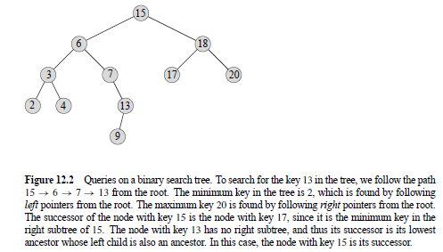

      * For node 13, it doesn't have right sub tree. So to find it successor, follow the path up, until the node have left child which is 15(6 also has left child but it's not in the path followed by 13)

      * ```python
        if x.right != NIL:
            return TREE-MINIMUM(x.right)
        y = x.parent
        while y != NIL and x == y.right:
            x = y
            y = y.parent
        return y
        ```

    * Predecessor: The node behind of given node(Same as successor)

  * Insert $O(H)$

    * Set trailing pointer y as the parent of x.

  * Delete $O(H)$

    * If no children, then simply remove it and modify its parent.
    * If just one children, then we set that child to the original position, modify its parent.
    * If has two children, f2
    * ind the successor(predecessor is also acceptable) to replace this node.

### Balanced Binary Search Trees

* Balance: each operation makes local adjustments. There're many types of Balanced BST. Such as AVL, Red-Black, 

#### AVL

* For each node, the depths of its subtrees differ by at most 1.

### Hash

#### Direct-address Tables

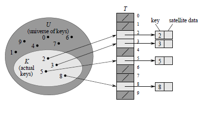

* All the operations takes $O(1)$ time.
* Search
* Insert
* Delete

#### Hash Tables

* Use Hash Function to compute the slot from the key. Map the universe keys into the slots of a hash table T[0...m-1]

* Could cause Collision.

  * Chaining: All the elements that hash to the same slot into the same linked list.

    * The worst insertion is O(1)
    * The worst search depends on the length of the list.
    * 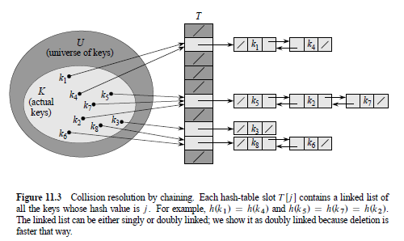

  * Open addressing

    * Linear Probing

      * $$
        h(k, i) = (h'(k) +i)mod\ m
        $$

    * Quadratic Probing

      * $$
        h(k,i)=(h'(k)+c_1i+c_2i^2)mod\ m
        $$

      * Could be the situation that:

      * $$
        1^2,-1^2,2^2,-2^2,3^2,-3^2...
        $$

    * Double Hashing

      * $$
        h(k,i)=(h_1(k)+ih_2(k))mod\ m
        $$

      * There are two hash function h1 and h2, once conflict, use the formula to find the next position.

### Priority Queues(Heaps)

* An extension of queue in which each element is associated with a priority and is served according to its priority.
* Min-heap or Max-heap
* Operations
  * Build $O(N)$
  * Insert O(log n)
    * Insert the new element at the end of the tree, heapify the tree.
  * Delete O(log n)
    * Swap the element with the last element, remove the last element, heapify the tree.
  * Search
    * Return the root.
  * Extractmin
    * Swap the root with the last element, heapify.

## Search Algorithms

### Overview


### Binary Search

* A fast search algorithm with run-time of $O(logn)$. Works on the principle of divide and conquer. And the data collection should be sorted.
* $mid = low + (high-low)/2$, determine half of the array.

## Graph

### Overview

* Graph $G=(V, E)$, $V\  node, E\  edge$

* Two types of graph:
  * Undirected graph
  * Directed graph
* Two types to representation
  * Sparse Graphs 
  * Adjacency List (When$|E|\ is\ much\ less\ than\ |V|^2$)
  * 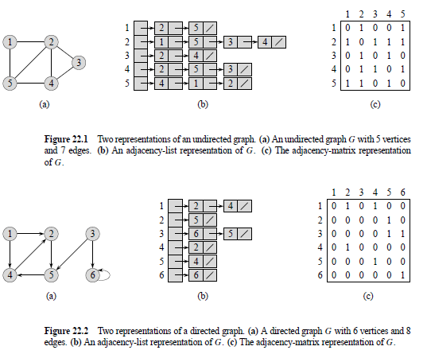

* Weight or not Weight
* cyclic or acyclic

* Connected Components for Undirected Graphs.
  * An induced subgraph C of G is a connected component if
    * C is connected
    * There is no path from C to any vertex not in C

* Strong Connectivity for Directed Graphs.
* Transitive closure
  * Graph $G^{*}=(V,E^{*})$. For each $(u,v) \in E^{*} $ iff there is a path from $u$ to $v$ in G
  * 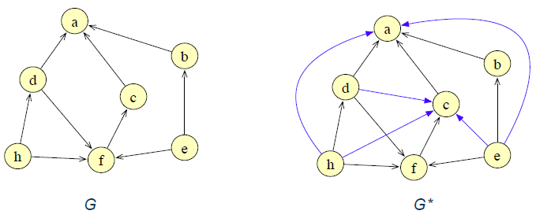
* Minimum Spanning Trees
  * From the graph $G=(V,E)$, we want to find the acyclic subset $T\in E$ that connects all of the vertices and the total weight is minimized.

### DFS

* Find until not found
* $O(V+E)$

### BFS

* Use queue to remember the neighbor for each node.
* $O(V+E)$
* Find the shortest path.

### Topological Sort

* DAG: Directed Acyclic Graph
* A topological sort is a linear ordering of all its vertices such that if $G$ contains an edge $(u,v)$, then $u$ appears before $v$ in the ordering. 
* If the graph contains a cycle, then no linear ordering is possible. And there could be more than one topological sorting for a graph. 

#### DFS Algorithm

* Use a temporary stack. Recursively call functions for all adjacent vertices, push it to a stack. 
* 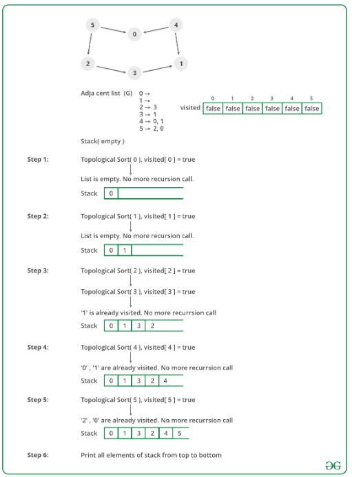
* Refer: [DFS For topological sort][https://www.geeksforgeeks.org/topological-sorting/]

### Transitive Closure Algorithm(Floyd-Warshall Algorithm)

* Based on Dynamic Programming, To find the shortest path between tow nodes.
* All-Pairs Shortest Paths, In a Weighted Graph with positive or negative edge weights(but with no negative cycles)
* In each iteration $k,\ T[u,v] = 1$ iff there is a path from $u$ to $v$ using intermediate vertices in $\{1, 2, ... , k\}$ 
* 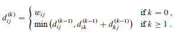
* 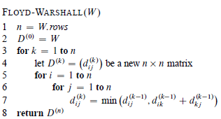
* Run time is $O(n^3)$

### Bellman-Ford Algorithm

* Based on Dynamic Programming
* The edge weights could be negative
* First calculate at-most one edges, then at-most two edges...
* $dist^{1}[u] = arcs[v_0][u]$
  $dist^k[u] = min\{dist^{k-1}[u],min\{dist^{k-1}[i]+arcs[i][u]\}\}\ for \ i \ in \ all \ the \ nodes$
* 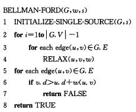
* 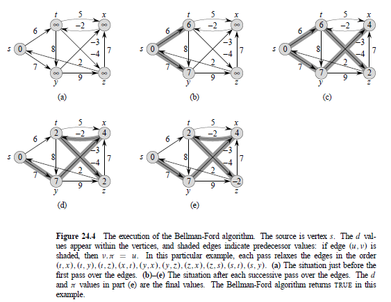
* Run time is $O(VE)$

### Dijkstra Algorithm

* Based on Greedy Algorithm, To find the shortest path.
* All edge weights are nonnegative.
* Maintains a set $S$ of vertices whose final shortest-path weights from the source $s$ have already been determined. Then repeatedly selects the vertex $u\in\ V-S$ with the minimum shortest-path estimate, adds $u$ to $S$, relaxes all edges leaving $u$.
* 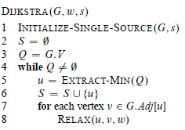
* 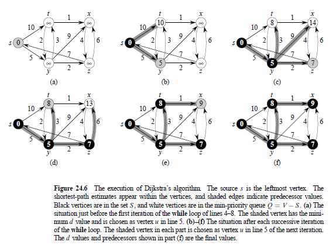
* Run time is $O(n^2)$

### Kruskal Algorithm

* Based on Greedy Algorithm, To find the Minimum Spanning Trees.

* Find the minimum weight edge.

* 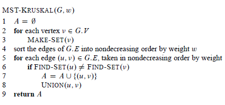

* 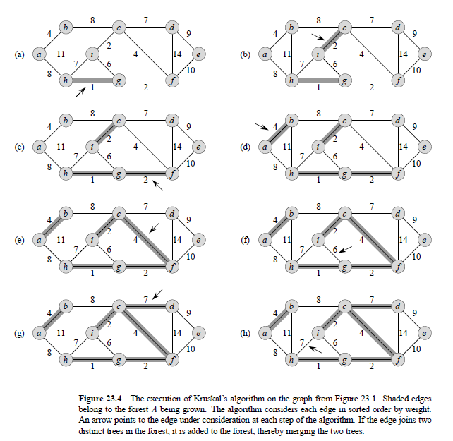

  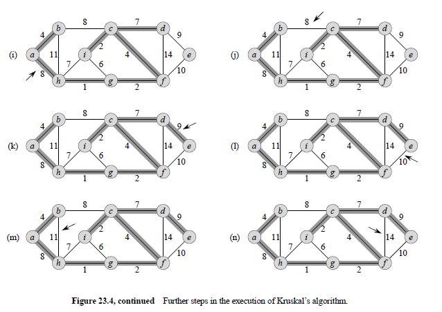

* Run time is $O(ElogV)$

### Prim Algorithm

* Based on Greedy Algorithm, To find the Minimum Spanning Trees.
* 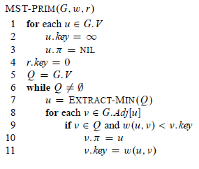
* 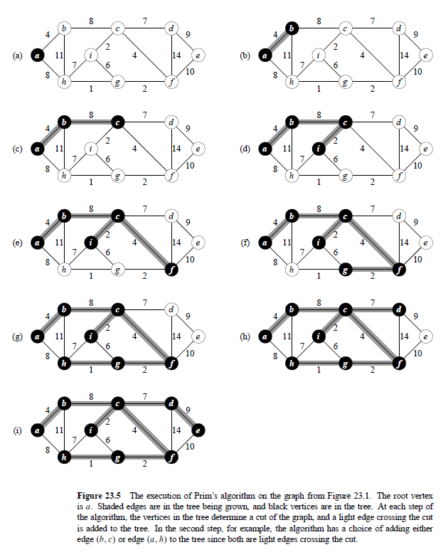

* Run time is $O(E+VlogV)$

## Advanced Data Structures


## Master Theorem Method

* Provides bounds for recurrences of the form
  $$
  T(n) = aT(\frac{n}{b}) +f(n)
  $$
  where $a\ge 1, b\ge 1$ and $f(n)$ is a given function which arise frequently. And there are three cases .

  * If $f(n) = O(n^{log_b(a-\varepsilon)})$ for some constant $\varepsilon > 0$, then $T(n)=O(n^{log_b{a}})$
  * If $f(n) = O(n^{log_b(a)})$then $T(n)=O(n^{log_b{a}}lgn)$
  * If $f(n) = O(n^{log_b(a+\varepsilon)})$ for some constant $\varepsilon > 0$, and if $af(n/b) \le cf(n)$ for some constant $c < 1$ and all sufficiently large $n$, then $T(n)=O(f(n))$

* To be short(but not so actually), just compare $f(n) \ with \ n^{log_b(a)}$
  * The first is smaller than the formula
  * The second is equal to the formula
  * The third is greater than the formula

## Recursion and Iteration

### Recursion

* Call itself

### Iteration

* Use a loop

## 


## Other Algorithm

### Floyd's algorithm Tortoise and Hare

* Phase 1

  * 
  * fast: hare, slow: tortoise
  * The cycle is labelled from $0$ to $C-1$, then $C$ is the length of the cycle.
  * The noncyclic is labelled from $-F$ to $-1$, then F is the length of the noncyclic.
  * After $F$ iterations, tortoise points to node 0 and hare points to some node $h$. $f\equiv h \ mod \ C$. Hare traverses $2F$, and exactly $F$ are in cycle.
  * After $C-h$, tortoise points to node $C-h$, hare points to the same node, because it traverse $2(C-h)$ from $h$,
  * $h+2(C-h) = 2C-h \equiv  C-h(mod\ C)$

* Phase 2

  * 

  * $$
    2*distance(tortoise) = distance(hare)\\2(F+a)=F+a+b+a\\2F+2a=F+2a+b\\F=b
    $$

  * Then pointer start at node $h$ and $0$ will traverse the same number of nodes before meeting

[https://www.cnblogs.com/onepixel/p/7674659.html]: 