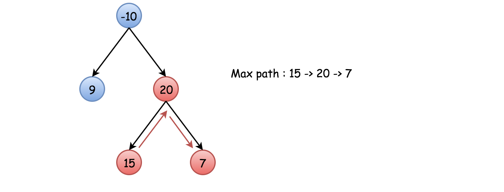
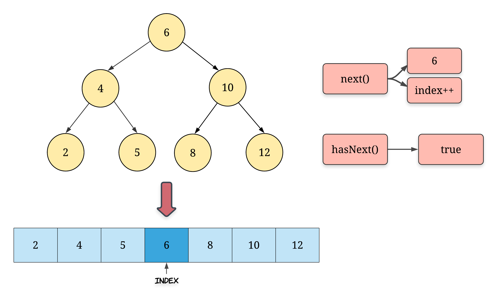

# Tree

## 104. Maximum Depth of Binary Tree

```
Given a binary tree, find its maximum depth.

The maximum depth is the number of nodes along the longest path from the root node down to the farthest leaf node.

Note: A leaf is a node with no children.

Example:

Given binary tree [3,9,20,null,null,15,7],

    3
   / \
  9  20
    /  \
   15   7
return its depth = 3.
```

### Solution 1. DFS

* Traverse by DFS

```python
# Definition for a binary tree node.
# class TreeNode:
#     def __init__(self, x):
#         self.val = x
#         self.left = None
#         self.right = None

class Solution:
    def maxDepth(self, root: TreeNode) -> int:
        if not root:
            return 0
        
        left_height = self.maxDepth(root.left)
        right_height = self.maxDepth(root.right)
        
        return max(left_height, right_height) + 1
    
```

### Solution 2. BFS

* Use queue

```python
# Definition for a binary tree node.
# class TreeNode:
#     def __init__(self, x):
#         self.val = x
#         self.left = None
#         self.right = None

class Solution:
    def maxDepth(self, root: TreeNode) -> int:
        if not root:
            return 0
        queue = []
        depth = 0
        queue.append(root)
        while queue:
            depth += 1
            for i in range(len(queue)):
                temp = queue.pop(0)
                if temp.left: queue.append(temp.left)
                if temp.right: queue.append(temp.right)
        return depth
       
```

### Solution 3. Stack

```python
# Definition for a binary tree node.
# class TreeNode:
#     def __init__(self, x):
#         self.val = x
#         self.left = None
#         self.right = None

class Solution:
    def maxDepth(self, root: TreeNode) -> int:
        stack = []
        if not root:
            return 0
        else:
            stack.append((1, root))
            
        depth = 0
        while stack != []:
            cur_depth, node = stack.pop()
            if node:
                depth = max(depth, cur_depth)
                stack.append((cur_depth+1, node.left))
                stack.append((cur_depth+1, node.right))
            
        return depth
```

## 226. Invert Binary Tree

```
Invert a binary tree.

Example:

Input:

     4
   /   \
  2     7
 / \   / \
1   3 6   9
Output:

     4
   /   \
  7     2
 / \   / \
9   6 3   1
Trivia:
This problem was inspired by this original tweet by Max Howell:

Google: 90% of our engineers use the software you wrote (Homebrew), but you can’t invert a binary tree on a whiteboard so f*** off.
```

### Solution 1. Recursive

```python
# Definition for a binary tree node.
# class TreeNode:
#     def __init__(self, x):
#         self.val = x
#         self.left = None
#         self.right = None

class Solution:
    def invertTree(self, root: TreeNode) -> TreeNode:
        if not root:
            return 
        
        L = self.invertTree(root.left)
        R = self.invertTree(root.right)
        
        root.left = R
        root.right = L
        
        return root
```

### Solution 2. Iteration

```python
# Definition for a binary tree node.
# class TreeNode:
#     def __init__(self, x):
#         self.val = x
#         self.left = None
#         self.right = None

class Solution:
    def invertTree(self, root: TreeNode) -> TreeNode:
        if not root:
            return
        queue = [root]
        while queue:
            cur = queue.pop(0)
            temp = cur.left
            cur.left = cur.right
            cur.right = temp
            if cur.left:
                queue.append(cur.left)
            if cur.right:
                queue.append(cur.right)
        return root
```

## 543. Diameter of Binary Tree

```
Given a binary tree, you need to compute the length of the diameter of the tree. The diameter of a binary tree is the length of the longest path between any two nodes in a tree. This path may or may not pass through the root.

Example:
Given a binary tree
          1
         / \
        2   3
       / \     
      4   5    
Return 3, which is the length of the path [4,2,1,3] or [5,2,1,3].

Note: The length of path between two nodes is represented by the number of edges between them.
```

### Solution 1. DFS

```python
# Definition for a binary tree node.
# class TreeNode:
#     def __init__(self, x):
#         self.val = x
#         self.left = None
#         self.right = None

class Solution:
    def diameterOfBinaryTree(self, root: TreeNode) -> int:
        self.ans = 0
        def depth(root):
            if not root:
                return 0
            left = depth(root.left)
            right = depth(root.right)
            self.ans = max(self.ans, left+right)
            return max(left,right)+1
        depth(root)
        return self.ans
```

## 94. Binary Tree Inorder Traversal

```
Given a binary tree, return the inorder traversal of its nodes' values.

Example:

Input: [1,null,2,3]
   1
    \
     2
    /
   3

Output: [1,3,2]
Follow up: Recursive solution is trivial, could you do it iteratively?
```

### Solution 1. Recursive

```python
# Definition for a binary tree node.
# class TreeNode:
#     def __init__(self, x):
#         self.val = x
#         self.left = None
#         self.right = None

class Solution:
    def inorderTraversal(self, root: TreeNode) -> List[int]:
        ans = []
        self.helper(root, ans)
        return ans 
        
    def helper(self, root, ans):
        if root:
            self.helper(root.left, ans)
            ans.append(root.val)
            self.helper(root.right, ans)
```

### Solution 2. Iterative 

```python
# Definition for a binary tree node.
# class TreeNode:
#     def __init__(self, x):
#         self.val = x
#         self.left = None
#         self.right = None

class Solution:
    def inorderTraversal(self, root: TreeNode) -> List[int]:
        ans = []
        stack = []
        curr = root
        while curr or stack:
            while curr:
                stack.append(curr)
                curr = curr.left
            curr = stack.pop()
            ans.append(curr.val)
            curr = curr.right
        return ans
```

## 105. Construct Binary Tree from Preorder and Inorder Traversal

```
Given preorder and inorder traversal of a tree, construct the binary tree.

Note:
You may assume that duplicates do not exist in the tree.

For example, given

preorder = [3,9,20,15,7]
inorder = [9,3,15,20,7]
Return the following binary tree:

    3
   / \
  9  20
    /  \
   15   7
```

### Solution 1. Recursion

```python
# Definition for a binary tree node.
# class TreeNode:
#     def __init__(self, x):
#         self.val = x
#         self.left = None
#         self.right = None

class Solution:
    def buildTree(self, preorder: List[int], inorder: List[int]) -> TreeNode:
        if len(preorder) == 0:
            return None
        
        root = TreeNode(preorder[0])
        middle = inorder.index(preorder[0])
        
        root.left = self.buildTree(preorder[1:middle+1], inorder[:middle])
        root.right = self.buildTree(preorder[middle+1:], inorder[middle+1:])

        return root
```

* The time complexity will be $O(n^2)$

### Solution 2. Recursion

* Instead of using index which cause $O(n)$, we use $hashtable$ to make $O(1)$

```python
# Definition for a binary tree node.
# class TreeNode:
#     def __init__(self, x):
#         self.val = x
#         self.left = None
#         self.right = None

class Solution:
    def buildTree(self, preorder: List[int], inorder: List[int]) -> TreeNode:
            
        if len(preorder) == 0:
            return None
        
        index_map = collections.defaultdict(int)
        
        for idx, val in enumerate(inorder):
            index_map[val] = idx
            
        def helper(l = 0, r = len(inorder)):
            if l == r:
                return None
            
            temp = preorder[self.pre]
            root = TreeNode(temp)
            
            index = index_map[temp]
            
            self.pre += 1
            
            root.left = helper(l, index)
            root.right = helper(index + 1, r)
            
            return root
        
        self.pre = 0
        root = helper()
        return root
```

## 102. Binary Tree Level Order Traversal

```
Given a binary tree, return the level order traversal of its nodes' values. (ie, from left to right, level by level).

For example:
Given binary tree [3,9,20,null,null,15,7],
    3
   / \
  9  20
    /  \
   15   7
return its level order traversal as:
[
  [3],
  [9,20],
  [15,7]
]
```

### Solution 1. Recursion

```python
# Definition for a binary tree node.
# class TreeNode:
#     def __init__(self, x):
#         self.val = x
#         self.left = None
#         self.right = None

class Solution:
    def levelOrder(self, root: TreeNode) -> List[List[int]]:
        ans = []
        if not root:
            return ans
        
        def helper(node, level):
            if len(ans) == level:
                ans.append([])
            
            ans[level].append(node.val)
            
            if node.left:
                helper(node.left, level+1)
            if node.right:
                helper(node.right, level+1)
        
        helper(root, 0)
        return ans
```

## 124. Binary Tree Maximum Path Sum

```
Given a non-empty binary tree, find the maximum path sum.

For this problem, a path is defined as any sequence of nodes from some starting node to any node in the tree along the parent-child connections. The path must contain at least one node and does not need to go through the root.

Example 1:

Input: [1,2,3]

       1
      / \
     2   3

Output: 6
Example 2:

Input: [-10,9,20,null,null,15,7]

   -10
   / \
  9  20
    /  \
   15   7

Output: 42
```

### Solution 1. Recursion

* Initiate `max_sum` as the smallest possible integer and call `max_gain(node = root)`.
* Implement `max_gain(node)`with a check to continue the old path/to start a new path:
  - Base case : if node is null, the max gain is `0`.
  - Call `max_gain` recursively for the node children to compute max gain from the left and right subtrees : `left_gain = max(max_gain(node.left), 0)` and
    `right_gain = max(max_gain(node.right), 0)`.
  - Now check to continue the old path or to start a new path. To start a new path would cost `price_newpath = node.val + left_gain + right_gain`. Update `max_sum` if it's better to start a new path.
  - For the recursion return the max gain the node and one/zero of its subtrees could add to the current path : `node.val + max(left_gain, right_gain)`.




```python
# Definition for a binary tree node.
# class TreeNode:
#     def __init__(self, val=0, left=None, right=None):
#         self.val = val
#         self.left = left
#         self.right = right
class Solution:
    def maxPathSum(self, root: TreeNode) -> int:
        def max_gain(node):
            if not node:
                return 0
            
            left_gain = max(max_gain(node.left), 0)
            right_gain = max(max_gain(node.right), 0)
            
            self.max_sum = max(self.max_sum, node.val + left_gain + right_gain)
            
            return node.val + max(left_gain, right_gain)
        
        self.max_sum = float("-inf")
        max_gain(root)
        return self.max_sum
```

## 114. Flatten Binary Tree to Linked List

```
Given a binary tree, flatten it to a linked list in-place.

For example, given the following tree:

    1
   / \
  2   5
 / \   \
3   4   6
The flattened tree should look like:

1
 \
  2
   \
    3
     \
      4
       \
        5
         \
          6
```

### Solution 1. Recursion

```python
# Definition for a binary tree node.
# class TreeNode:
#     def __init__(self, val=0, left=None, right=None):
#         self.val = val
#         self.left = left
#         self.right = right
class Solution:
    def flatten(self, root: TreeNode) -> None:
        """
        Do not return anything, modify root in-place instead.
        """
        def dfs(node):
            if not node:
                return 
            
            if not node.left and not node.right:
                return node
            
            leftSub = dfs(node.left)
            rightSub = dfs(node.right)
            
            if leftSub:
                leftSub.right = node.right
                node.right = node.left
                node.left = None
            return rightSub if rightSub else leftSub
        
        return dfs(root)
```

## 173. Binary Search Tree Iterator


```
Implement an iterator over a binary search tree (BST). Your iterator will be initialized with the root node of a BST.

Calling next() will return the next smallest number in the BST.

 

Example:


BSTIterator iterator = new BSTIterator(root);
iterator.next();    // return 3
iterator.next();    // return 7
iterator.hasNext(); // return true
iterator.next();    // return 9
iterator.hasNext(); // return true
iterator.next();    // return 15
iterator.hasNext(); // return true
iterator.next();    // return 20
iterator.hasNext(); // return false
 

Note:

next() and hasNext() should run in average O(1) time and uses O(h) memory, where h is the height of the tree.
You may assume that next() call will always be valid, that is, there will be at least a next smallest number in the BST when next() is called.
```

### Solution 1. Flatten the BST



```python
# Definition for a binary tree node.
# class TreeNode:
#     def __init__(self, val=0, left=None, right=None):
#         self.val = val
#         self.left = left
#         self.right = right
class BSTIterator:

    def __init__(self, root: TreeNode):
        self.stack = []
        self.traverse(root)
        
    def traverse(self, node):
        while node:
            self.stack.append(node)
            node = node.left

    def next(self) -> int:
        """
        @return the next smallest number
        """
        ans = self.stack.pop()
        if ans.right:
            self.traverse(ans.right)
        return ans.val
        

    def hasNext(self) -> bool:
        """
        @return whether we have a next smallest number
        """
        return len(self.stack) > 0
        


# Your BSTIterator object will be instantiated and called as such:
# obj = BSTIterator(root)
# param_1 = obj.next()
# param_2 = obj.hasNext()
```

